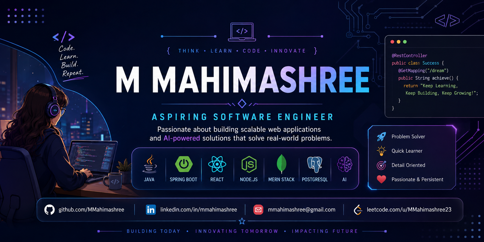

  

<h1 align="center">Hi 👋, I'm M Mahimashree</h1>

<h3 align="center">
Aspiring Software Engineer | Java Full Stack | MERN Stack | Backend Development
</h3>

Passionate about building software that solves real-world problems through Java, Spring Boot, React, MERN Stack, AI, and Backend Development.

## 👩‍💻 About Me

🎓 B.E. Computer Science Engineering Student

💻 Aspiring Software Engineer with a strong interest in Backend and Full Stack Development.

🌱 Currently learning Java, Spring Boot, System Design, and strengthening my Data Structures & Algorithms skills.

🤖 I enjoy building AI-powered applications and scalable web solutions that solve real-world problems.

🚀 Explored Entrepreneurship & Innovation through the Canara Innovation Foundation, where I worked on startup ideas and learned how technology can create real-world impact.

📍 Mangalore, Karnataka, India

---

## 📊 GitHub Analytics

  
  

  

---

## 🚀 My Journey

My journey started with curiosity about software development and gradually expanded into AI, full-stack development, and entrepreneurship.

During my engineering journey, I have built AI-powered applications, REST APIs, and full-stack web projects while continuously improving my problem-solving skills.

One of my proudest experiences was participating in the **Entrepreneurship Development Program**, where I presented my startup idea before an expert judging panel and secured **🥈 2nd Place among 49 shortlisted teams**. That experience strengthened my confidence, communication skills, and passion for building impactful products.

Today, my goal is simple:

> **Become a Software Engineer who builds technology that makes people's lives easier.**

---

## 💻 Tech Stack

### Programming Languages

### Backend

### Frontend

### Database

### Tools

---

## 🌟 Featured Projects

### 🚀 Mahi Orbit – HR Dashboard
**Java • Spring Boot • React • PostgreSQL • Hibernate**

A full-stack HR Management System featuring employee management, REST APIs, department management, salary analytics, authentication, and a responsive React frontend.

---

### 🤖 AI Medical Chatbot
**Python • Streamlit • Machine Learning**

AI-powered medical assistant that predicts diseases based on symptoms and recommends appropriate doctors.

---

### 🔒 Smart Microblog Privacy Guard
**React • FastAPI • SQLite • NLP**

Privacy-focused social platform that detects sensitive personal information before users publish posts using AI and Natural Language Processing.

---

### 📄 AI Resume Screener
**Python • Machine Learning • Explainable AI**

Analyzes resumes and recommends suitable technology roles while explaining prediction results.

---

### ✅ Task Manager API
**Java • Spring Boot**

RESTful Task Management backend implementing CRUD operations with clean architecture.

---

## 🏆 Achievements

🥈 Secured **2nd Place** in the Entrepreneurship Development Program Final Pitch by presenting an innovative startup idea before an expert judging panel.

🏅 Top 7 – AI Medical Ideathon (NMAMIT)

🚀 Selected Participant – EMERGE 2026 Startup Festival

💡 Entrepreneurship Development Program – Canara Innovation Foundation

🏆 SAP Hackfest Participant

📚 Completed Java Full Stack & MERN Stack Training

---

## 🌱 Currently Learning

- Spring Boot Security
- JWT Authentication
- Microservices
- Docker
- AWS
- Advanced Data Structures & Algorithms

---

## 🌐 Connect With Me

💼 **LinkedIn**  
https://linkedin.com/in/mmahimashree

💻 **GitHub**  
https://github.com/MMahimashree

🧩 **LeetCode**  
https://leetcode.com/u/MMahimashree23/

📧 **Email**  
mmahimashree@gmail.com

---

<h3 align="center">
✨ Building today. Learning every day. Growing into the Software Engineer I aspire to become.
</h3>
