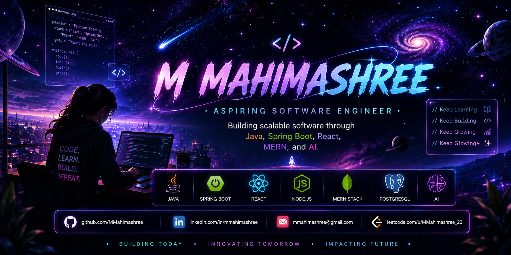

<!-- 🌌 Profile Banner -->

  

<h1 align="center">Hi 👋, I'm M Mahimashree</h1>

  <b>Aspiring Software Engineer | Java • Spring Boot • React • MERN</b>

  Building software that solves real-world problems.

---

## 👩‍💻 About Me

- 🎓 B.E. Computer Science Engineering Student
- 💻 Aspiring Software Engineer with a strong interest in Backend & Full Stack Development
- 🌱 Currently learning Java, Spring Boot, System Design, and strengthening my Data Structures & Algorithms skills
- 🤖 Passionate about building AI-powered applications and scalable web solutions
- 🚀 Explored Entrepreneurship & Innovation through the Canara Innovation Foundation, working on startup ideas and real-world problem solving
- 🏆 Secured **🥈 2nd Place** in the Entrepreneurship Development Program Final Pitch among **49 shortlisted teams**
- 📍 Mangalore, Karnataka, India

---

## 🔥 GitHub Streak

  

---

## 🚀 My Journey

My journey started with curiosity about software development and gradually expanded into **AI, Full Stack Development, and Entrepreneurship**.

During my engineering journey, I have built AI-powered applications, REST APIs, and full-stack web projects while continuously improving my technical skills.

One of my proudest moments was presenting my startup idea during the **Entrepreneurship Development Program Final Pitch**, where I secured **🥈 2nd Place among 49 shortlisted teams**.

That experience strengthened my confidence, communication skills, and passion for building impactful products.

> **My goal is to become a Software Engineer who builds technology that creates real-world impact.**

---

# 💻 Tech Stack

### 👨‍💻 Programming Languages

  

### ⚙️ Backend

  

### 🎨 Frontend

  

### 🗄️ Database

  

### 🛠️ Tools & Technologies

  

### ☁️ Deployment & Cloud

  

---

# 🌟 Featured Projects

### 🚀 Mahi Orbit – HR Dashboard

**Java • Spring Boot • React • PostgreSQL • Hibernate**

A full-stack HR Management System featuring:

- Employee management
- Department management
- Salary analytics
- REST APIs
- Authentication
- Responsive React frontend

---

### 🤖 AI Medical Chatbot

**Python • Streamlit • Machine Learning**

AI-powered medical assistant that predicts diseases based on symptoms and recommends appropriate doctors.

---

### 🔒 Smart Microblog Privacy Guard

**React • FastAPI • SQLite • NLP**

Privacy-focused social platform that detects sensitive personal information before users publish posts using Natural Language Processing.

---

### 📄 AI Resume Screener

**Python • Machine Learning • Explainable AI**

AI-based Resume Analyzer that predicts suitable technology roles and explains the prediction results.

---

### ✅ Task Manager API

**Java • Spring Boot**

RESTful Task Management backend implementing CRUD operations using clean architecture.

---

# 🏆 Achievements

- 🥈 **2nd Place** – Entrepreneurship Development Program Final Pitch among **49 shortlisted teams**
- 🏅 **Top 7** – AI Medical Ideathon, NMAMIT
- 🚀 **Selected Participant** – EMERGE 2026 Startup Festival
- 💡 **Entrepreneurship Development Program** – Canara Innovation Foundation
- 🏆 **SAP Hackfest Participant**
- 📚 **Java Full Stack & MERN Stack Training**
- 💻 **230+ LeetCode Problems Solved**

---

# 🌱 Currently Learning

- Spring Security
- JWT Authentication
- Microservices
- Docker
- AWS
- Advanced Data Structures & Algorithms
- System Design

---

# 🌐 Connect With Me

---

✨ <b>Building today. Learning every day. Growing into the Software Engineer I aspire to become.</b> ✨

  

